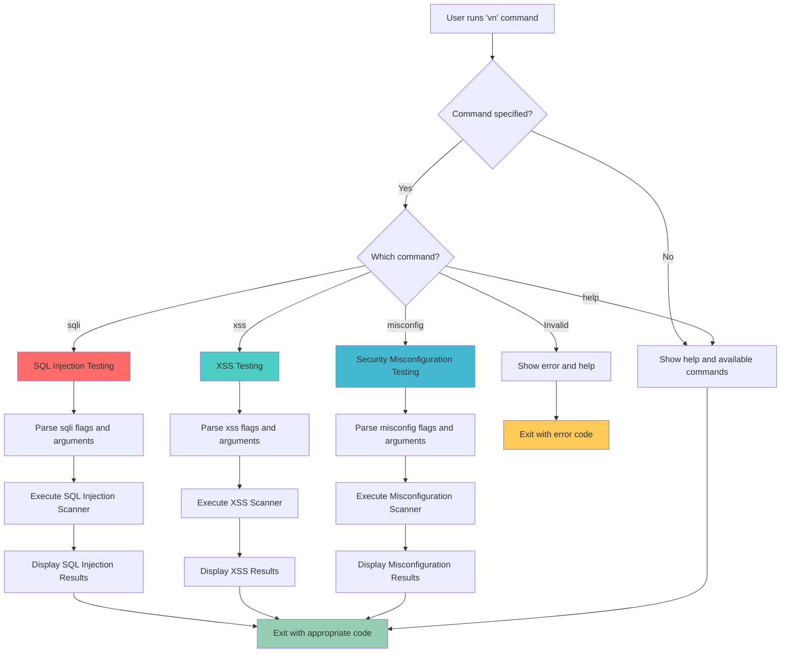
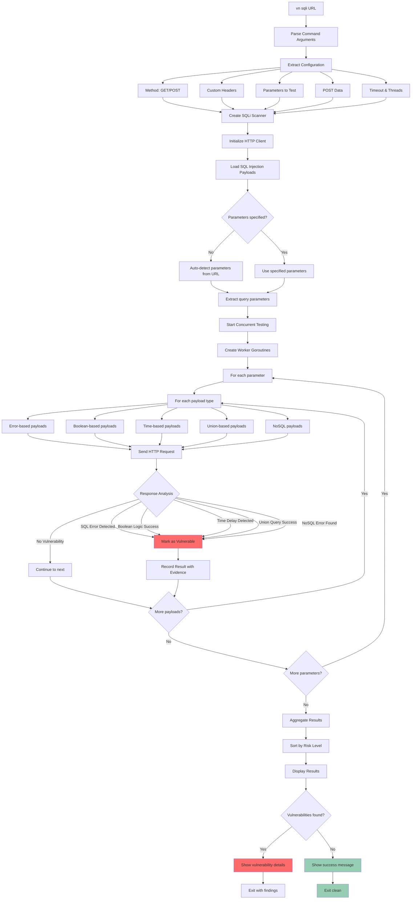
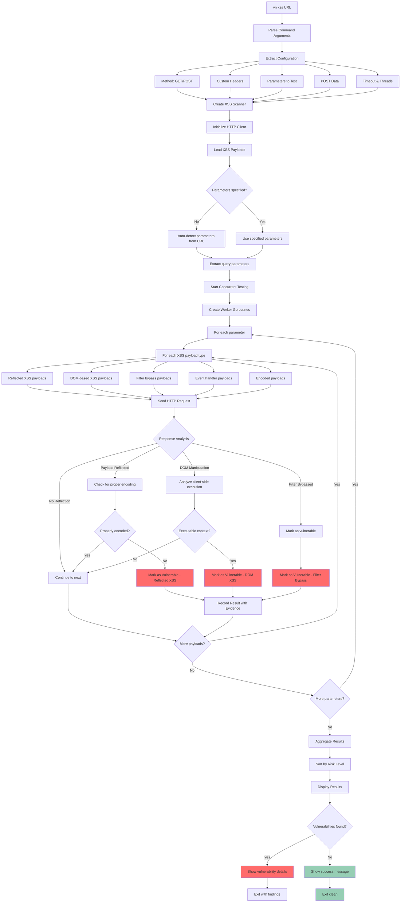
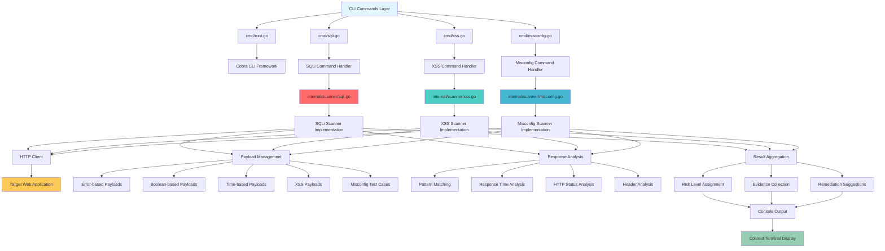
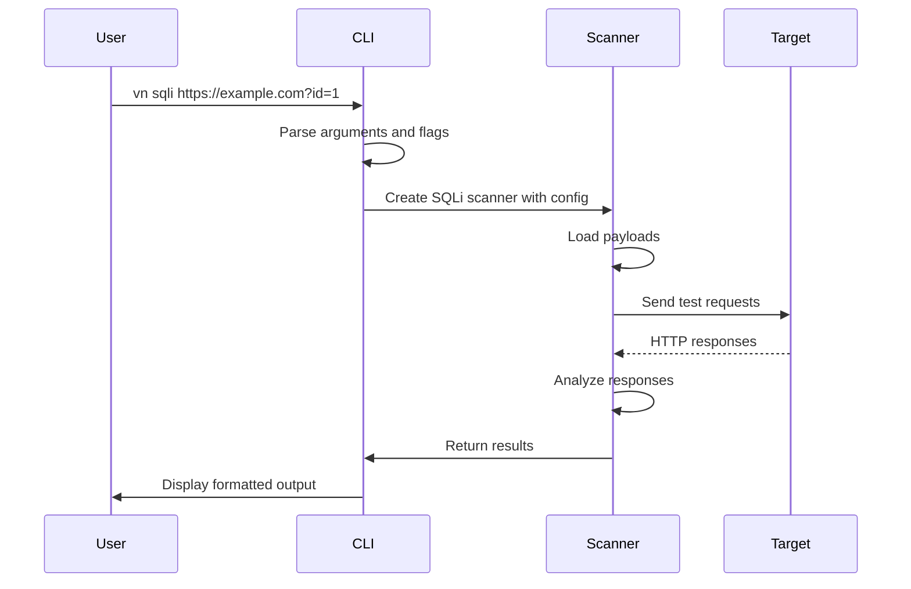
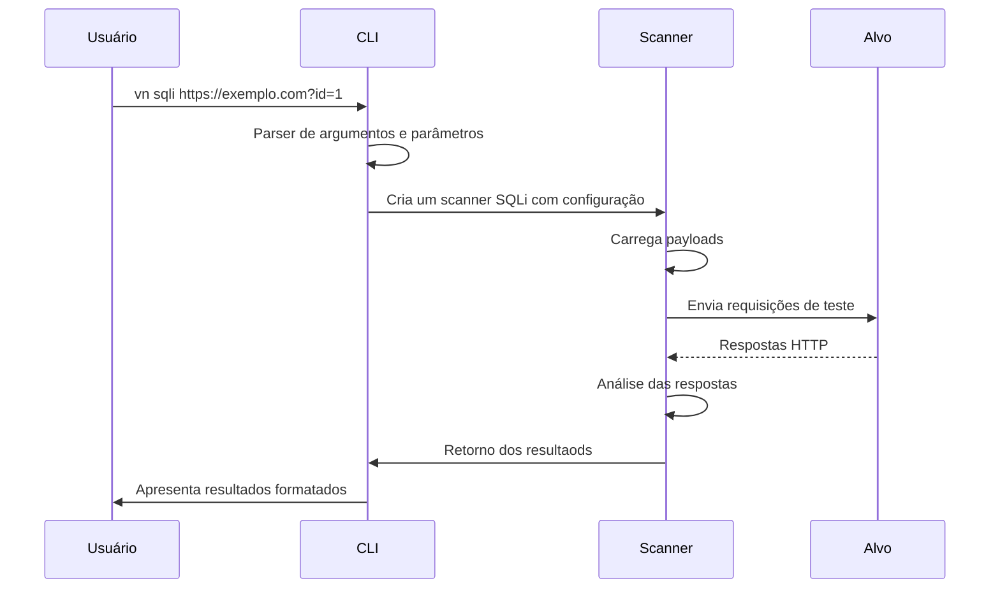
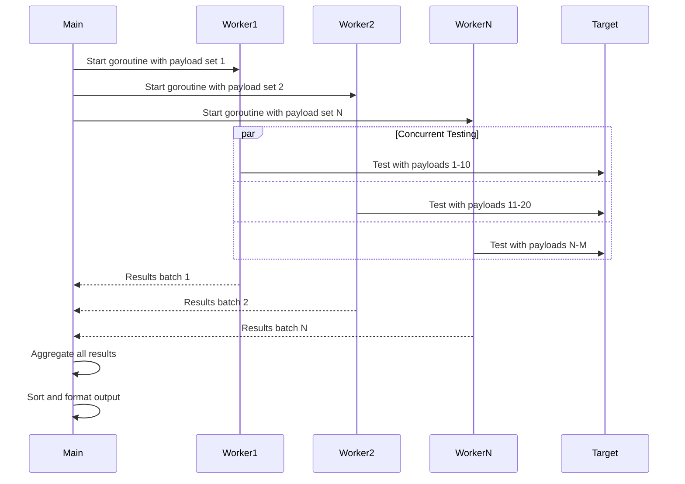

# VN - Vulnerability Navigator Flowcharts

This document contains comprehensive flowcharts documenting the functionality and architecture of the VN CLI tool.

## 1. Main CLI Flow



## 2. SQL Injection Testing Flow



## 3. XSS Testing Flow



## 4. Security Misconfiguration Testing Flow

```mermaid
flowchart TD
    A[vn misconfig URL] --> B[Parse Command Arguments]
    
    B --> C[Extract Configuration]
    C --> D[Method: GET/POST]
    C --> E[Custom Headers]
    C --> F[Test Categories]
    C --> G[Timeout & Threads]
    
    D --> H[Create Misconfig Scanner]
    E --> H
    F --> H
    G --> H
    
    H --> I[Initialize HTTP Client]
    I --> J{Test categories specified?}
    
    J -->|No| K[Run all test categories]
    J -->|Yes| L[Run specified categories]
    
    K --> M[Test Categories: files, headers, defaults, server]
    L --> M
    
    M --> N[Start Concurrent Testing]
    N --> O[Create Worker Goroutines]
    
    O --> P{Test Category}
    
    P -->|files| Q[Sensitive Files Testing]
    P -->|headers| R[Security Headers Testing]
    P -->|defaults| S[Default Credentials Testing]
    P -->|server| T[Server Configuration Testing]
    
    Q --> Q1[Test for exposed files]
    Q1 --> Q2[/.env, /config.php, /.git/, /backup/]
    Q2 --> Q3[/admin/, /.htaccess, /web.config]
    Q3 --> Q4[Check HTTP response codes]
    Q4 --> Q5{File accessible?}
    Q5 -->|Yes| Q6[Mark as High Risk]
    Q5 -->|No| U[Continue to next test]
    
    R --> R1[Test security headers]
    R1 --> R2[X-Frame-Options, CSP, HSTS]
    R2 --> R3[X-Content-Type-Options, etc.]
    R3 --> R4[Check response headers]
    R4 --> R5{Headers missing?}
    R5 -->|Yes| R6[Mark as Medium Risk]
    R5 -->|No| U
    
    S --> S1[Test default credentials]
    S1 --> S2[admin:admin, admin:password]
    S2 --> S3[root:root, test:test]
    S3 --> S4[Send authentication requests]
    S4 --> S5{Authentication successful?}
    S5 -->|Yes| S6[Mark as High Risk]
    S5 -->|No| U
    
    T --> T1[Test server configuration]
    T1 --> T2[HTTP methods, redirects]
    T2 --> T3[Information disclosure]
    T3 --> T4[Check server responses]
    T4 --> T5{Misconfiguration found?}
    T5 -->|Yes| T6[Mark appropriate risk level]
    T5 -->|No| U
    
    Q6 --> V[Record Result with Evidence]
    R6 --> V
    S6 --> V
    T6 --> V
    U --> W{More tests?}
    V --> W
    
    W -->|Yes| P
    W -->|No| X[Aggregate Results]
    
    X --> Y[Sort by Risk Level and Category]
    Y --> Z[Generate Summary Statistics]
    Z --> AA[Display Results by Category]
    
    AA --> BB{Misconfigurations found?}
    BB -->|Yes| CC[Show detailed findings]
    BB -->|No| DD[Show success message]
    
    CC --> EE[Show remediation advice]
    EE --> FF[Exit with findings]
    DD --> GG[Exit clean]
    
    style Q6 fill:#ff6b6b
    style R6 fill:#feca57
    style S6 fill:#ff6b6b
    style T6 fill:#ff6b6b,#feca57,#96ceb4
    style CC fill:#ff6b6b
    style DD fill:#96ceb4
    style FF fill:#ff6b6b
    style GG fill:#96ceb4
```

## 5. Scanner Architecture Overview



## 6. Data Flow Architecture

```mermaid
flowchart LR
    A[User Input] --> B[Command Parser]
    B --> C[Configuration Object]
    
    C --> D[Scanner Factory]
    D --> E{Scanner Type}
    
    E -->|SQLi| F[SQLi Scanner]
    E -->|XSS| G[XSS Scanner]
    E -->|Misconfig| H[Misconfig Scanner]
    
    F --> I[HTTP Request Builder]
    G --> I
    H --> I
    
    I --> J[Payload Injection]
    J --> K[HTTP Client]
    K --> L[Target Application]
    
    L --> M[HTTP Response]
    M --> N[Response Analyzer]
    
    N --> O{Vulnerability Detected?}
    O -->|Yes| P[Create Vulnerability Record]
    O -->|No| Q[Continue Testing]
    
    P --> R[Evidence Collection]
    R --> S[Risk Assessment]
    S --> T[Result Object]
    
    Q --> U{More Tests?}
    U -->|Yes| J
    U -->|No| V[Finalize Results]
    
    T --> W[Results Aggregator]
    V --> W
    
    W --> X[Results Formatter]
    X --> Y[Console Output]
    
    style A fill:#e1f5fe
    style L fill:#feca57
    style P fill:#ff6b6b
    style Y fill:#96ceb4
```



## Usage Examples

### Basic Usage Flow


PT


### Concurrent Testing Flow
